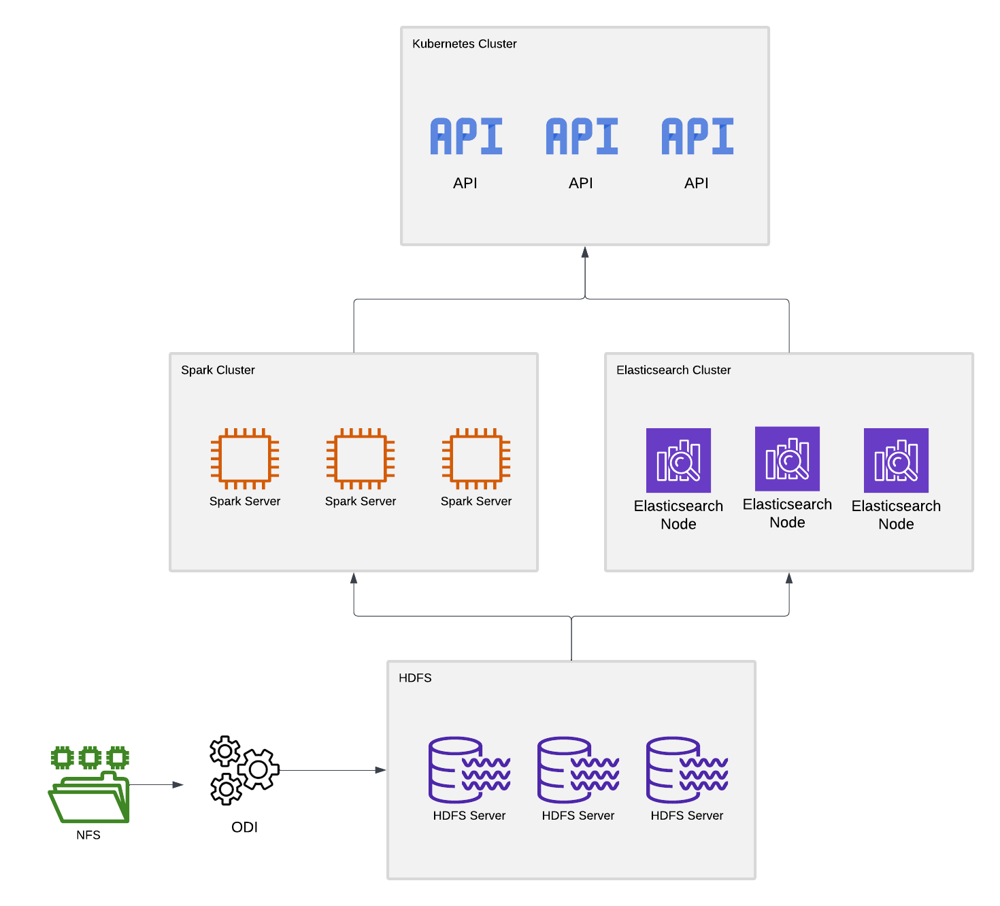

# Solution for Big Data Storage and Querying

## Architectural Design

### Data Ingestion

The ingestion process requires automation to collect log files from an NFS server and load them into a distributed storage system.

- **Tools**:
  - Apache Nifi, Flume or tools like Cloudera DataFlow can automate log ingestion.
  - Oracle Data Integrator (ODI) can also be used for integration pipelines if needed.
- **Process**:
  - Files are scanned in specified folder structures on the NFS server.
  - Logs are batched and loaded into distributed storage (HDFS or S3-compatible object storage).
  - Metadata is extracted and indexed during ingestion.
- **Disaster Recovery**:
  - Ingestion workflows should include retry mechanisms for failed tasks.
  - Replication of ingestion pipelines across multiple availability zones.

---

### Data Storage

Logs must be stored in a queryable format with partitioning by date and log type to optimize query performance.

- **Storage Technologies**:
  - **On-premise**: HDFS (Hadoop Distributed File System) in a Cloudera ecosystem.
  - **Cloud-based**: S3-compatible object storage such as Amazon S3, MinIO, or Google Cloud Storage.
- **File Formats**: Parquet or ORC for efficient columnar storage and compression.
- **Partitioning**: Data should be partitioned by date and log type to enhance retrieval speed.
- **Retention**:
  - Implement lifecycle policies to delete logs after 2 years.
- **Disaster Recovery**:
  - Use replication mechanisms provided by HDFS or S3-compatible systems.
  - Periodic snapshots and backups should be stored in geographically distant locations.

---

### Data Processing and Querying

Data querying depends on the storage backend, with different technologies for HDFS and object storage.

1. **HDFS Storage**:
   - Use Apache Hive or Apache Impala for SQL-based querying.
   - Apache Spark SQL can handle more complex analytical queries.
2. **S3-Compatible Object Storage**:
   - Utilize Presto/Trino for distributed SQL querying.
   - Apache Spark can access S3 storage for ETL tasks.
3. **Elasticsearch Integration**:
   - Logs can also be indexed into Elasticsearch for fast text-based searches and analytics.
   - Elastic can complement the data warehouse by providing search capabilities.
- **Disaster Recovery**:
  - Deploy distributed query engines with redundancy.
  - Regularly back up metadata and query configurations.

---

### Middleware and Query Interface

An API layer serves as the interface for users to interact with the query engine and access the data.

- **API Frameworks**:
  - Spring Boot or FastAPI for building RESTful APIs.
- **Caching Utilities**:
  - Redis for caching frequently accessed query results or data.
- **Interactive Querying**:
  - Tools like Apache Superset or Metabase for dashboards and direct query execution.
- **Deployment**:
  - Kubernetes can be used to deploy and manage API services for scalability and failover handling.
- **Elasticsearch Integration**:
  - APIs can directly connect to Elasticsearch for specific log-type queries with low latency.
- **Disaster Recovery**:
  - Deploy the middleware in a multi-region Kubernetes cluster.
  - Use rolling backups for API service configurations.

---

## Monitoring and Management
To monitor system performance and ensure SLA compliance:

### Monitoring Tools:
- **Prometheus and Grafana:** Used to monitor Spark jobs, HDFS status, and Elasticsearch performance.

### Alerting:
- Alerts are sent via email or SMS if queries exceed SLA thresholds or if a server fails.

---

## Recommended Technologies and Resources

| **Component**            | **Technology**                                | **Resource**                                         |
|---------------------------|-----------------------------------------------|-----------------------------------------------------|
| Data Ingestion            | Apache Nifi, Flume, ODI                    | Multi-core CPUs, 64 GB RAM, scalable storage       |
| Storage                   | HDFS, Amazon S3, MinIO                       | At least 15 PB distributed storage with replication|
| Query Engines             | Apache Hive, Trino, Apache Spark, Elasticsearch | 128 GB RAM per node, scalable cluster             |
| Middleware/API Layer      | Spring Boot, FastAPI, Redis                  | 64 GB RAM, Kubernetes-based deployment            |
| Interactive Querying      | Apache Superset, Metabase                    | Moderate resources for dashboard visualization     |
| Disaster Recovery Storage | Cloud Storage or On-prem Backup Nodes        | Cross-region storage, regular snapshots            |

This architecture ensures scalability, adheres to SLA requirements, and incorporates robust disaster recovery mechanisms for high reliability.

## Topology

